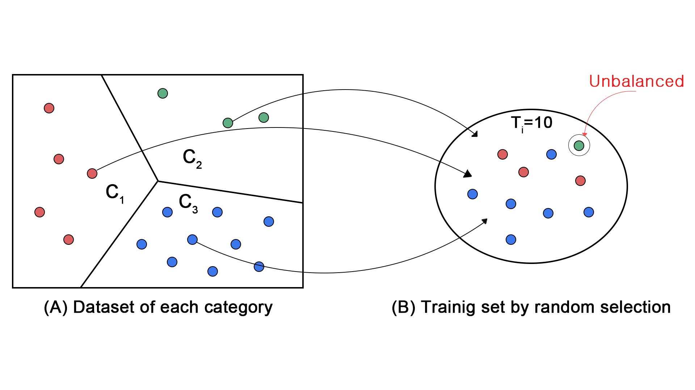

# ⚙️ 제한된 데이터의 회전체 결함 진단을 위한 클래스 균형 샘플링 기반 소수-샷 학습
> **A Few-shot Learning Method based on Class-balanced Sampling to Diagnose Rotor Defects of Limited Data**

  
  
  

 

> **⚠️ Notice**
> 본 프로젝트는 연구실 보안 규정 및 지적 재산권 보호를 위해 **소스코드(Source Code)는 공개하지 않습니다.**
> 대신 본 리포지토리에는 연구의 핵심 방법론, 모델 아키텍처 설계, 그리고 실험 성과를 상세히 기술하였습니다.

---

## 📌 1. Abstract (연구 요약)
산업용 기기의 고장 진단 분야에서 양질의 데이터를 확보하는 것은 매우 어렵습니다. 기존의 딥러닝 방식은 대량의 데이터를 필요로 하며, 적은 데이터를 사용하는 소수-샷 학습(Few-shot Learning)조차 무작위 샘플링(Random Sampling) 방식으로 인해 학습 편차가 크다는 한계가 있었습니다.

본 연구는 데이터 간의 통계적 분포(평균, 분산)를 활용한 **클래스 균형 샘플링(Class-balanced Sampling)** 기법을 제안하여, 제한된 데이터 환경에서도 **기존 대비 약 5~17%의 성능 향상**을 달성했습니다.

---

## 🧐 2. Motivation (연구 배경)
### ❌ The Problem: Random Sampling의 불안정성

* 기존 소수-샷 학습은 학습 데이터를 무작위(Random)로 선택합니다.
* 이는 매 훈련 시 데이터 분포의 불균형을 초래하여, 모델의 정확도 차이가 크게 발생하고 특정 데이터에 과적합될 위험이 있습니다.

---

## 💡 3. Methodology (핵심 방법론)
우리는 데이터의 통계적 특성을 반영하여 학습 데이터를 선별하는 **유사도(SR) 기반 파이프라인**을 설계했습니다.

### 3.1. System Architecture

1.  **Preprocessing:** 시계열 진동 데이터를 윈도우 슬라이싱하여 입력 벡터 구성.
2.  **Data Selection (Core Logic):** 데이터 분포의 평균($\mu$)과 분산($\sigma$)을 기반으로 학습에 가장 효과적인 데이터를 우선 선별.
3.  **Siamese Network:** 샴 네트워크 구조를 통해 결함 데이터 간의 거리(Distance)를 학습하여 분류 수행.

### 3.2. Class-Balanced Sampling Algorithm
데이터 분포상 **평균(Mean)에 집중된 데이터를 우선 선택**하고, 점차 범위를 확대해 나가는 전략을 사용합니다. 이를 위해 다음과 같은 **유사도(Similarity Ratio)** 공식을 고안했습니다.

$$SR = \frac{d \pm \sigma}{mean(x)}$$

* $d$: 데이터 간의 거리 (Distance between samples)
* $\sigma$: 분산 (Variance)
* $mean(x)$: 해당 범주의 평균 (Mean of the category)

이 수식을 통해 각 데이터가 범주의 중심에서 얼마나 벗어나 있는지 판단하고, 학습 가중치를 차등적으로 부여하여 일반화 성능을 높였습니다.

---

## 📊 4. Experiments (실험 및 성과)
### 4.1. Dataset: CWRU Bearing Data
Case Western Reserve University(CWRU)의 베어링 결함 데이터를 사용하여 검증했습니다.

| Fault Location | Diameter (inch) | Label Code |
| :--- | :--- | :---: |
| **Normal (None)** | - | 2 |
| **Ball** | 0.007, 0.014, 0.021 | 1, 3, 4 |
| **Inner Race** | 0.007, 0.014, 0.021 | 6, 7, 8 |
| **Outer Race** | 0.007, 0.014, 0.021 | 0, 9, 10 |

### 4.2. Quantitative Results

* **성능 향상:** 90개의 극소수 데이터만 사용했을 때, 기존 무작위 방식 대비 정확도가 **약 5~17% 향상**되었습니다.
* **안정성:** 데이터가 부족한 산업 현장 환경에서도 **80% 이상의 높은 진단 정확도**를 확보했습니다.

### 4.3. Qualitative Results (Confusion Matrix)

* 혼동 행렬(Confusion Matrix) 분석 결과, 제안하는 방법이 예측 라벨과 실제 라벨을 정확하게 분류함을 확인했습니다.

---

## 📝 5. Publication (논문 게재)
본 연구는 한국정보과학회(KIISE) 학술발표대회에서 발표되었습니다.

* **Title:** A Few-shot Learning Method based on Class-balanced Sampling to Diagnose Rotor Defects of Limited Data
* **Authors:** Hayoul Kim, Gyebong Jang, Sung-Bae Cho (Yonsei University)
* **Conference:** Korea Computer Congress 2021 (KCC 2021)
